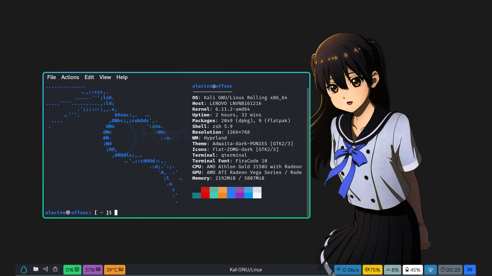

# Hyprland Dotfiles


Free bloat❗️ just installed from repo❗️ nothing outside the repo❗️ hyprland, waybar, swaybg, wofi, brightnessctl, pulseaudio and amixer✅

|  Preview  |
|  -  |
|    |
| <p align="center"> **No 🍚 In Here** </p> |

# How To Install

```zsh
git clone --depth=1 https://github.com/cilegordev/Hyprland-dotfiles ~/Hyprland-dotfiles
cd ~/Hyprland-dotfiles
cp -rv ./* .[^/]* ~
```
# Keybinds

|  Press  |  Command  |
|  -  |  -  |
| <kbd>Super</kbd> + <kbd>Esc</kbd> | logout
| <kbd>Super</kbd> + <kbd>~</kbd> | qterminal
| <kbd>Super</kbd> + <kbd>Q</kbd> | floating
| <kbd>Super</kbd> + <kbd>W</kbd> | killactive
| <kbd>Super</kbd> + <kbd>E</kbd> | fullscreen
| <kbd>Super</kbd> + <kbd>A</kbd> | thunar
| <kbd>Super</kbd> + <kbd>S</kbd> | firefox
| <kbd>Super</kbd> + <kbd>D</kbd> | wofi

 <p align="center"> 
   
 </p> 

# License

[GNU General Public License v3.0](LICENSE)
