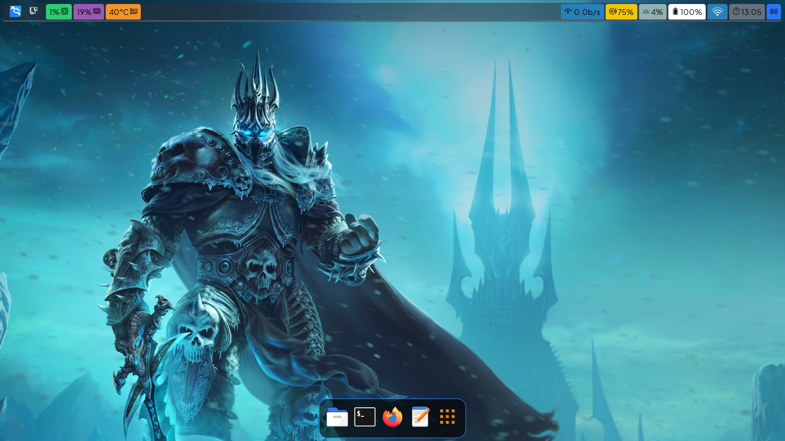

# Hyprland Dotfiles


repo source
- hyprland
- waybar
- playerctl 
- power-profiles-daemon
- mpd
- brightnessctl 
- linux-firmware 
- alsa-utils 
- amixer 
- pulseaudio 
- pavucontrol

other source
- wofi
- nwg-dock-hyprland
- nwg-drawer

|  Preview  |
|  -  |
|    |
| <p align="center"> **No 🍚 In Here** </p> |

# How To Install

```zsh
git clone --depth=1 https://github.com/cilegordev/Hyprland-dotfiles ~/Hyprland-dotfiles
cd ~/Hyprland-dotfiles
cp -rv ./* .[^/]* ~
cd ~
rm -rfv .git cat-on-line.png LICENSE README.md Screenshot.png Hyprland-dotfiles
```
# Keybinds

|  Press  |  Command  |
|  -  |  -  |
| <kbd>Super</kbd> + <kbd>Esc</kbd> | logout
| <kbd>Super</kbd> + <kbd>~</kbd> | qterminal
| <kbd>Super</kbd> + <kbd>Q</kbd> | floating
| <kbd>Super</kbd> + <kbd>W</kbd> | killactive
| <kbd>Super</kbd> + <kbd>E</kbd> | fullscreen
| <kbd>Super</kbd> + <kbd>A</kbd> | thunar
| <kbd>Super</kbd> + <kbd>S</kbd> | firefox
| <kbd>Super</kbd> + <kbd>D</kbd> | xfce4-appfinder

 <p align="center"> 
   
 </p> 